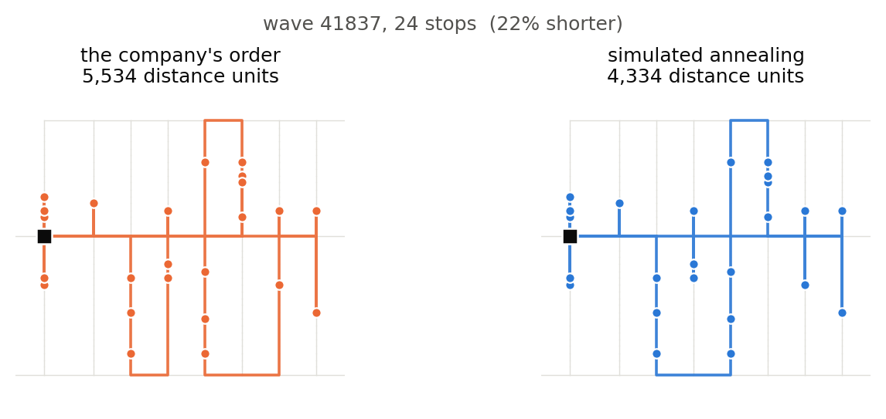

# Warehouse Pick-Path Optimiser

Route optimisation for order picking in a real footwear warehouse.

A picker collects every item in a picking wave from shelves across the warehouse floor and
returns to the packing station. Racking blocks direct movement, so travel is restricted to
17 horizontal aisles and 3 vertical corridors. The question is which order to visit the
stops in.

Walking distances come from graph search on the aisle network — uniform cost search to build
the 466 × 466 distance matrix, A\* to answer single-pair queries and verify that matrix
independently. **Simulated Annealing** and a **Genetic Algorithm** then compete to find the
shortest visiting order. The search layer is the cost model; the two metaheuristics are what
is being compared.

## Result

Measured on 2,225 picking waves from July 2023 onwards, held out entirely from tuning:

| Method | Walking saved | Waves made worse | Time per wave |
|---|---|---|---|
| Nearest neighbour | 10.0% | 307 of 2,225 | 0.08 ms |
| **Simulated annealing** | **16.5%** | **8 of 2,225** | 121 ms |
| Genetic algorithm | 16.1% | 12 of 2,225 | 235 ms |



Simulated annealing wins on quality (Wilcoxon p < 0.001 on both tuning and held-out waves),
on consistency, and on cost. It is not a large margin in route length — the two find the
identical route on 70% of waves — but the genetic algorithm loses on every axis at once.

The project's most useful finding was a mistake in its own method. The cooling schedule was
originally chosen on waves small enough that the four candidates were separated by less than
a tenth of a percentage point, a tie that carried no information. Re-tested on large waves,
the chosen schedule turned out to be worse than doing nothing at every budget tested below
10,000 evaluations.

## The warehouse

| | |
|---|---|
| Storage locations | 2,292 across 4 rack levels |
| Distinct floor stops | 466 |
| Aisles / corridors | 17 horizontal, 3 vertical |
| Longest walk | 2,080 units (≈ 208 m if decimetres) |
| Routable picking waves | 5,858 (8–24 stops each) |

The dataset gives coordinates without stating what they measure, so every result here is
reported as a percentage.

## Method

- Pick locations are mapped to the aisle position a picker stands in to reach them.
- Uniform cost search on the aisle network gives exact walking distances, verified against an
  independently written A\* implementation.
- Distances are precomputed into a 466 × 466 matrix so route evaluation is array lookups.
- Waves are split chronologically at 1 July 2023: earlier waves tune parameters, later waves
  are held out entirely as unseen test data.
- Both techniques receive identical objective-evaluation budgets, counted rather than assumed.

## Baselines

Results are measured against the warehouse's own picking order, not against a random one.
That choice matters: a random order walks 76% further than the optimum where the company's
own walks only 17% further, so measuring against random would inflate any reported
improvement roughly fourfold.

| Baseline | Gap above the true optimum |
|---|---|
| Random order | +76.0% |
| Listed order (the company's) | +17.1% |
| Nearest neighbour | +4.6% |

Exact optima come from Held-Karp dynamic programming on waves small enough to solve exactly,
giving ground truth rather than only relative comparisons.

## Data

Not included in this repository.

> de Assis, R. F. et al. *Order Picking Dataset from a Warehouse of a Footwear
> Manufacturing Company.* Mendeley Data, V1.
> https://doi.org/10.17632/pf2w725pw3.1

Download it and upload these five files to a folder in Google Drive:

```
Storage_Location.csv
Support_Points_Navigation.csv
Picking_Wave.csv
Customer_Order.csv
Product.csv
```

The notebook searches Drive for `Storage_Location.csv` and uses whichever folder contains it,
so the folder name does not matter.

## Running it

Open `notebooks/Nguyen_LeBinh_AT1_1_notebook.ipynb` in Google Colab and run all cells.

The two long experiments cache their results to Drive, so a second run reloads them instead
of repeating about twenty minutes of work. Deleting those CSVs forces a fresh run.

## Status

Built for 42172 Introduction to AI, University of Technology Sydney.
